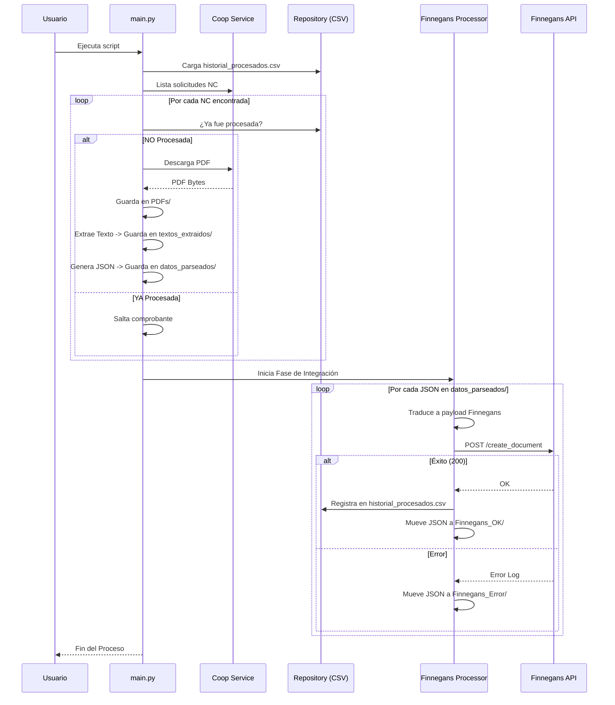

# Pipeline de Notas de Crédito (Coop -> Finnegans)

Este proyecto automatiza la descarga de Solicitudes de Notas de Crédito (NC) desde el portal de proveedores de Cooperativa Obrera y su posterior carga en el ERP Finnegans.

## Arquitectura Modular

El sistema está dividido en dos grandes fases coordinadas por un único punto de entrada (`main.py`):

1.  **Fase 1: Extracción (Coop Service)**
    *   Se conecta al portal de la Coop.
    *   Descarga los PDFs de las NCs de los últimos N días o rango específico.
    *   Extrae el texto y genera archivos JSON en `SolicitudNCCoop/datos_parseados`.
2.  **Fase 2: Integración (Finnegans Processor)**
    *   Lee los JSONs generados.
    *   Traduce los datos al formato de Finnegans usando reglas de negocio (0271, 0272, etc.).
    *   **Aplica filtros de exclusión**: Omite envíos para ciertos clientes configurados por entorno.
    *   Busca facturas de referencia en Finnegans para aplicar la NC correctamente.
    *   Carga el documento final en Finnegans. (Soporta simulación con `--dry-run`).

## Requisitos

*   Python 3.9+
*   Dependencias: `pip install -r requirements.txt`

## Configuración (.env)

Asegúrate de tener un archivo `.env` con las siguientes claves:

```env
# Credenciales Portal Cooperativa Obrera
PORTAL_USER=usuario@ejemplo.com.ar
PLAIN_PASSWORD=tu_password_aqui

# Credenciales API Finnegans
FINNEGANS_CLIENT_ID=tu_client_id
FINNEGANS_CLIENT_SECRET=tu_client_secret
FINNEGANS_EMPRESA_COD=EMPRE01  # <--- Setea aquí la empresa destino

# Configuración de Red / API
BASE_URL=https://proveedoresback.cooperativaobrera.coop
HTTP_TIMEOUT=30
REINTENTOS=3
BACKOFF=0.5

# Parámetros de Proceso
DIAS_HACIA_ATRAS=15

# Filtros (Opcional)
EXCLUSION_POR_CLIENTES=17249,17250 # Códigos de clientes a NO procesar
```

## Mapeos (CSV)

Mantén actualizados los archivos en `mappings/`:
*   `productos_coop.csv`: Relaciona la descripción de la Coop con el código de Finnegans.
*   `sucursales_coop.csv`: Mapea el prefijo de recepción al código de cliente Finnegans.

## Uso y Parametrización

Para ejecutar el flujo completo con diversas opciones:

```bash
# Procesar rango de fechas específico
python main.py --desde 2024-01-01 --hasta 2024-01-31

# Filtrar un solo proveedor
python main.py --prov 12345

# Filtrar documentos específicos (lista separada por comas)
python main.py --doc-filter 27200375198,27200375199

# Limpiar directorios de salida antes de iniciar
python main.py --limpiar

# Simulación (descargar y procesa pero NO envía a Finnegans)
python main.py --dry-run

# Solo descargar los archivos PDF (sin procesar con Finnegans)
python main.py --solo-descarga

# Ejemplo completo: Limpiar, filtrar proveedor y simular
python main.py --limpiar --solo-prov 7150 --dry-run

# Sincronizar catálogo de productos (standalone)
python main.py --sync-catalog
```

## Sincronización de Catálogo

El comando `--sync-catalog` permite mantener actualizado `mappings/productos_coop.csv` automáticamente:
1.  Se conecta al portal e itera por todos los proveedores asociados a la cuenta.
2.  Obtiene la lista de productos vigentes.
3.  Genera la descripción compuesta: `{Nombre} {Gramaje}.2f{Unidad}` (ej: "TAPA PASC HOJALD COOPERAT 400.00grs").
4.  Si el producto no existe en el CSV, lo agrega al final con el código de Finnegans en blanco para que lo completes.

## Pruebas de Conexión (Finnegans)

Para validar únicamente la conectividad con la API de Finnegans sin procesar datos de la Cooperativa, puedes utilizar el script de diagnóstico:

```bash
python test_finnegans.py
```

Este script verificará:
1.  Obtención de un Token de acceso válido.
2.  Acceso al reporte de facturas (`APICONSULTAFACTURAVENTADY`).
3.  Búsqueda de una factura de muestra para confirmar permisos de lectura.

## Estructura de Directorios y Flujo de Trabajo

El sistema utiliza una estructura de carpetas organizada bajo `SolicitudNCCoop/` para garantizar la trazabilidad y permitir el reprocesamiento manual.

### Diagrama de Secuencia


### Detalle de Carpetas (`SolicitudNCCoop/`)

| Carpeta | Propósito | Tiempo de Vida |
| :--- | :--- | :--- |
| `datos_parseados/` | JSONs listos para ser subidos. | Temporal (se mueven al procesar) |
| `Finnegans_OK/` | Copia de seguridad de JSONs subidos con éxito. | Permanente |
| `Finnegans_Error/` | JSONs que fallaron (revisar para corregir mapeos). | Permanente |
| `PDFs/` | Archivo permanente de comprobantes originales. | Permanente |
| `textos_extraidos/` | Respaldo del texto parseado de cada PDF. | Permanente |
| `logs/` | Logs de ejecución y el archivo de historial. | Permanente |

## Filtros de Exclusión

El sistema permite ignorar ciertos códigos de clientes durante el procesamiento hacia Finnegans. Esto es útil para evitar cargar sucursales o clientes específicos que no deban ser integrados automáticamente.

Para configurar los clientes a excluir, usa la siguiente variable en tu `.env`:

```env
# Códigos de clientes a filtrar (separados por comas)
EXCLUSION_POR_CLIENTES=17249,17250
```

> [!NOTE]
> Cuando un cliente está en esta lista, el sistema descargará y parseará la NC (para registro histórico), pero **saltará el envío a Finnegans** y marcará el archivo como procesado exitosamente para evitar bloqueos en el pipeline.

> [!TIP]
> **Idempotencia y Reprocesamiento:** El archivo `SolicitudNCCoop/logs/historial_procesados.csv` es la fuente de verdad. Si necesitás volver a procesar un comprobante antiguo, simplemente **borrá la línea correspondiente** en ese CSV y ejecutá el script de nuevo.

## Extensibilidad (La Anónima, etc.)

La arquitectura actual está preparada para crecer:
1.  **Nuevos Portales:** Para agregar "La Anónima", basta con crear un `anonima_service.py` que herede/imite a `coop_service.py`.
2.  **Nuevos Traductores:** Si La Anónima tiene un formato distinto, se crea un `anonima_translator.py` para mapear sus campos a los `models.py` universales.
3.  **Mismo Destino:** Ambos usarán el mismo `FinnegansService` y `FinnegansProcessor`.

---

## Documentación Adicional

*   📄 [**COMPARISON_ARCHITECTURE.md**](./COMPARISON_ARCHITECTURE.md) — Análisis comparativo entre la arquitectura legacy (Rocketbot + Apps Script) y esta solución. Incluye una discusión estratégica sobre No-Code vs desarrollo asistido por IA, recomendada para equipos directivos y de tecnología.
